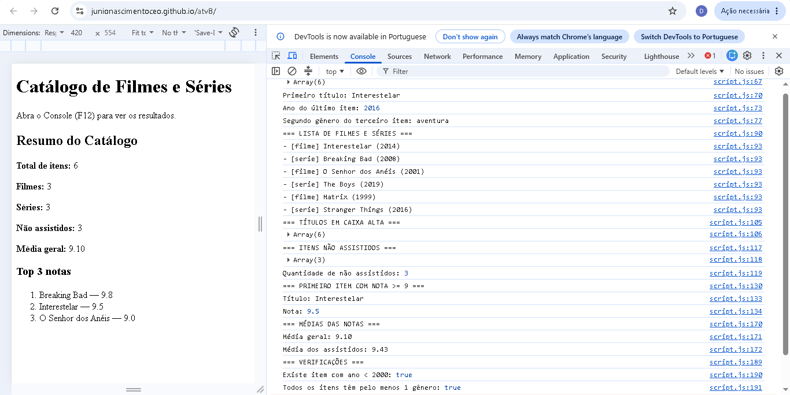
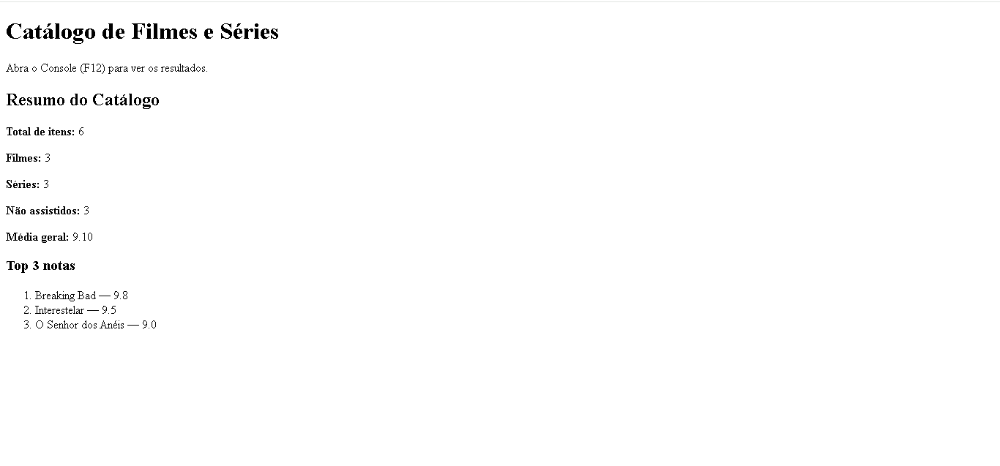

# Atividade Prática - Objetos e Arrays utilizando JSON

## Identificação

**Nome:** Junio César Nascimento Pereira
**Matrícula:** 934209

## Descrição

Mini catálogo de filmes e séries desenvolvido utilizando JavaScript, com manipulação de objetos e arrays e utilização de métodos iteradores.

## Funcionalidades

O projeto utiliza os seguintes métodos:

* `forEach()` — listagem dos filmes e séries;
* `map()` — transformação dos títulos para letras maiúsculas;
* `filter()` — seleção dos itens não assistidos;
* `find()` — busca do primeiro item com nota igual ou superior a 9;
* `reduce()` — cálculo das médias das notas;
* `some()` — verificação de item lançado antes do ano 2000;
* `every()` — verificação de itens que possuem pelo menos um gênero.

## Resultados

### Console

*Print do Console mostrando a lista de títulos, médias, `some()` e `every()`.*

> Inserir aqui o print do Console.

### Página

*Print da página mostrando o resumo do catálogo no `div#output`.*

> Inserir aqui o print da página.

## Tecnologias utilizadas

* HTML5
* JavaScript
* JSON
* GitHub
* GitHub Pages
### Console

### Página

